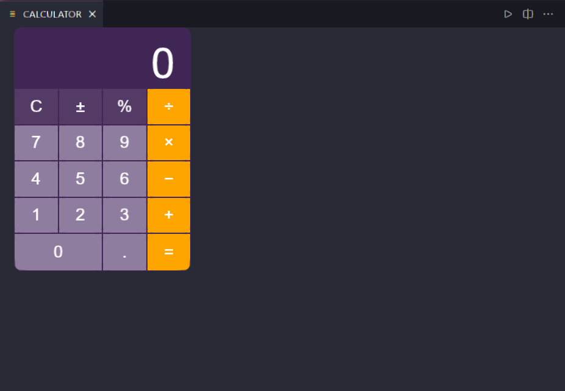

# CALCULATOR 

THIS IS THE README FOR YOUR EXTENSION "CALCULATOR". AFTER WRITING UP A BRIEF DESCRIPTION, WE RECOMMEND INCLUDING THE FOLLOWING SECTIONS.

## FEATURES

- BASIC ARITHMETIC OPERATIONS (ADDITION, SUBTRACTION, MULTIPLICATION, DIVISION).
- SCIENTIFIC CALCULATOR FUNCTIONALITY WITH TRIGONOMETRIC AND LOGARITHMIC OPERATIONS.
- HISTORY FEATURE TO REVIEW AND REUSE PREVIOUS CALCULATIONS.

## REQUIREMENTS

ENSURE THAT NODE.JS AND NPM ARE INSTALLED ON YOUR MACHINE.

## EXTENSION SETTINGS

THIS EXTENSION CONTRIBUTES THE FOLLOWING SETTINGS:

- `CALCULATOR.ENABLE`: ENABLE/DISABLE THE CALCULATOR EXTENSION.
- `CALCULATOR.THEME`: SET THE CALCULATOR THEME TO LIGHT OR DARK.

## KNOWN ISSUES

- DIVISION BY ZERO IS NOT HANDLED GRACEFULLY.
- TRIGONOMETRIC FUNCTIONS MIGHT HAVE PRECISION ISSUES.

## RELEASE NOTES

### v1.2.1

- RELEASE OF CALCULATOR EXTENSION.

## FOLLOWING EXTENSION GUIDELINES

ENSURE THAT YOU'VE READ THROUGH THE EXTENSIONS GUIDELINES AND FOLLOW THE BEST PRACTICES FOR CREATING YOUR EXTENSION.

## WORKING WITH MARKDOWN

YOU CAN AUTHOR YOUR README USING VISUAL STUDIO CODE. HERE ARE SOME USEFUL EDITOR KEYBOARD SHORTCUTS:

- SPLIT THE EDITOR (`CMD+\` ON MACOS OR `CTRL+\` ON WINDOWS AND LINUX).
- TOGGLE PREVIEW (`SHIFT+CMD+V` ON MACOS OR `SHIFT+CTRL+V` ON WINDOWS AND LINUX).
- PRESS `CTRL+SPACE` (WINDOWS, LINUX, MACOS) TO SEE A LIST OF MARKDOWN SNIPPETS.

## SCREENSHORT

<!--  -->

## FOR MORE INFORMATION

